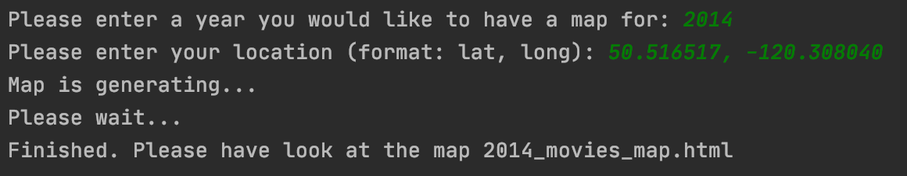
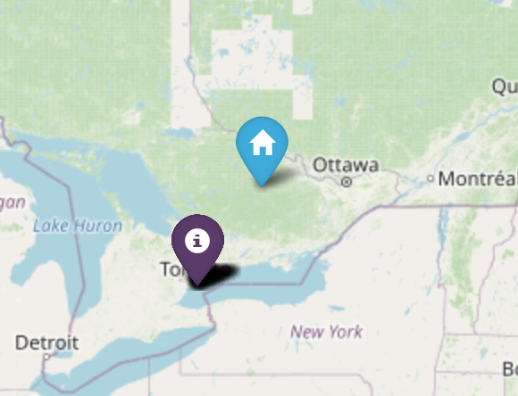
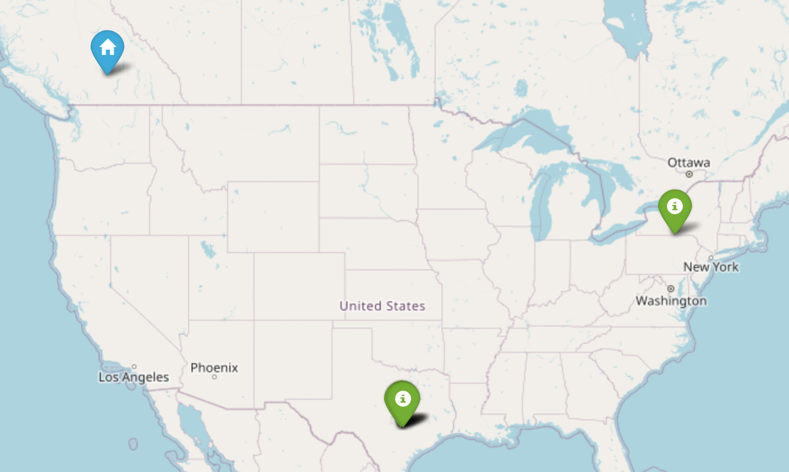

# Film locations map project

To run the program you need to run the *main.py* module. When prompted you need to enter the year for which 
you would like to have your map generated and the coordinates for your location

When the program finishes running it creates a *.html* file with the generated map

The blue icon shows the user's location, the purple icons 
show the nearest film locations in the same country as the user and the green ones are locations in other countries.